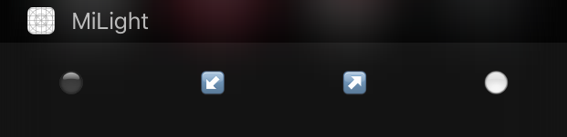

# MiWidget — Today widget for MiLight #

## Features ##

<ul>
<li>Quickly opens (much faster than official app)</li>
<li>Easy configuration for your bulb</li>
<li>No dependencies, just download and run!</li>
<li>Developed for iOS8+ (but should be compatible with iOS 7 if remove widget from app, iOS5+ if converted to Obj-C)</li>
</ul>

## "Not working for my buld!" ##

Probably you have other bulb type. Place suitable command bytes in [Config.swift](Config.swift). You can find commands for most MiLight bulbs [here](https://github.com/mwittig/node-milight-promise/blob/master/src/commands.js).

## License ##

MIT
